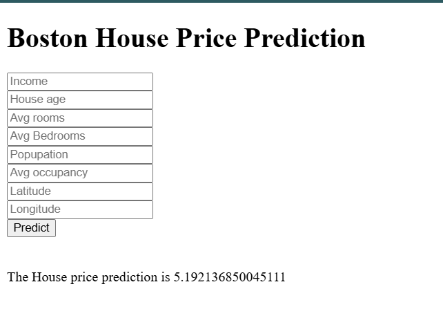

### California House Price Prediction

### Software and tools needed

1. [GitHub](https://github.com)
2. [HerokuAccount](https://heroku.com)
3. [VSCodeIDE](https://code.visualstudio.com/)
4. [GitCLI](https://git-scm.com/book/en/v2/Getting-Started-The-Command-Line)


Create a New environment

```
conda create -p venv python -y
```

## Here is the final HTML page with predicted value
User gives his values to get the Estimated price in california

